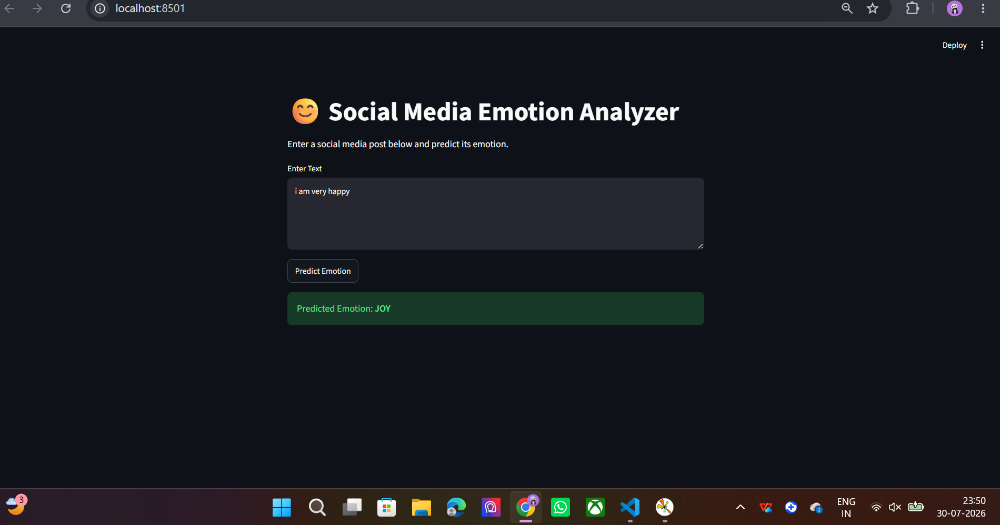
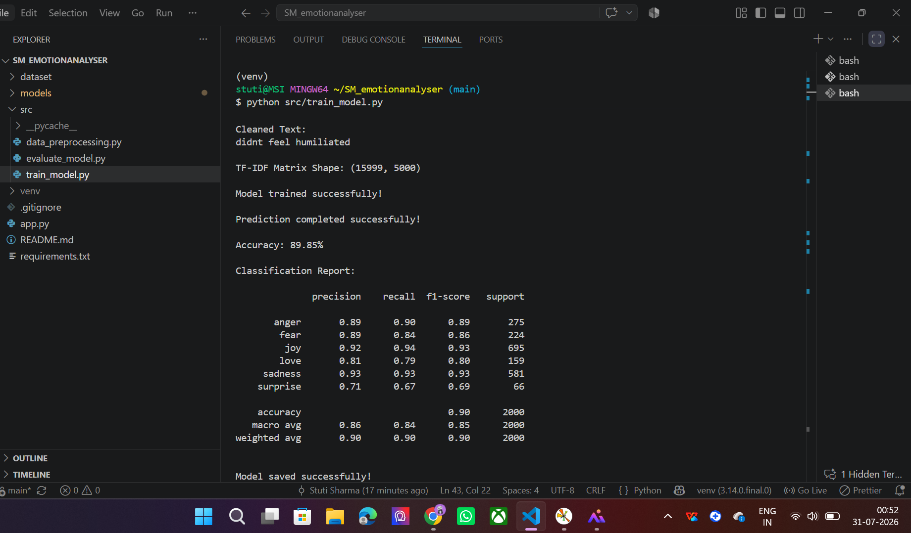

# 😊 Social Media Emotion Analyzer

A Machine Learning and NLP project that classifies emotions from social media text using TF-IDF Vectorization and a Linear SVM classifier.

---

## 📌 Project Overview

This project predicts the emotion expressed in a social media post by applying Natural Language Processing (NLP) techniques and Machine Learning.

The application performs text preprocessing, converts text into numerical features using TF-IDF, and classifies it into one of six emotions.

---

## 🎯 Features

- Emotion prediction from text
- Text preprocessing
- Stopword removal
- Lemmatization
- TF-IDF Vectorization
- Linear SVM classifier
- Interactive Streamlit web application
- Prediction history

---

## 🧠 Emotions Supported

- 😊 Joy
- 😢 Sadness
- 😡 Anger
- 😨 Fear
- ❤️ Love
- 😲 Surprise

---

## 🛠️ Tech Stack

- Python
- NLP
- NLTK
- TF-IDF Vectorizer
- Scikit-learn
- Linear SVM
- Streamlit
- Pandas
- Matplotlib
- Seaborn

---

## 📂 Project Structure

```
Social-Media-Emotion-Analyzer/
│
├── dataset/
│   ├── train.txt
│   ├── test.txt
│   └── val.txt
│
├── models/
│   ├── emotion_model.pkl
│   └── tfidf_vectorizer.pkl
│
├── src/
│   ├── data_preprocessing.py
│   ├── train_model.py
│   └── evaluate_model.py
│
├── app.py
├── requirements.txt
├── README.md
└── .gitignore
```

---

## ⚙️ Installation

Clone the repository

```bash
git clone https://github.com/your-username/Social-Media-Emotion-Analyzer.git
```

Go to the project directory

```bash
cd Social-Media-Emotion-Analyzer
```

Install dependencies

```bash
pip install -r requirements.txt
```

Run the application

```bash
streamlit run app.py
```

---

## 📊 Machine Learning Pipeline

1. Load Dataset
2. Remove Duplicates
3. Text Cleaning
4. Tokenization
5. Stopword Removal
6. Lemmatization
7. TF-IDF Feature Extraction
8. Train Linear SVM
9. Evaluate Model
10. Predict Emotion

---

## 📈 Model Performance

| Metric | Value |
|----------|--------|
| Model | Linear SVM |
| Vectorizer | TF-IDF |
| Accuracy | **89.85%** |

---

## 📷 Application
## Application Screenshots

### Home Page



### Prediction



---

## 👩‍💻 Author

**Stuti Sharma**

BCA (AI & ML)

---

## ⭐ If you like this project, give it a star.
